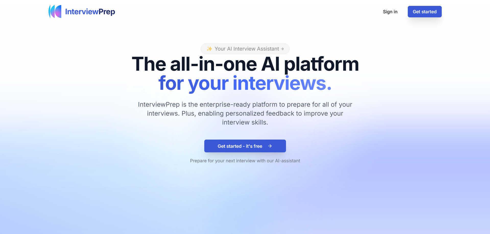
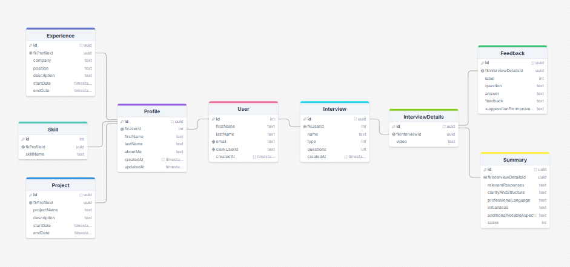

# [InterviewPrep - AI Interview Assistant](https://interviewprep-sigma.vercel.app/)



> Crack your next interview

## Solution

InterviewPrep streamlines the interview preparation process using AI-driven technology. Users can choose between two modes: Personal Interviews, tailored specifically to their profile, and Custom Interviews, designed based on selected skills and job descriptions. The platform is built with TypeScript, Next.js, and Supabase, ensuring a robust, scalable and distributed user experience using a message broker and worker pools.

## Features

- Streamlined Interview Creation
- AI-powered interview experience
- Interview feedback and summary
- Distributed systems using message queue and worker pools.
- Uses a message broker for efficient processing.
- Google OAuth using Supabase
- Personal interview based on your profile
- Custom interview according to your usecase
- Beautiful User Interface


## DB Diagram



## Tech Stack

- **Next.js** - React framework for production
- **TypeScript** - Superset of JavaScript for type safety
- **Tailwind CSS** - Utility-first CSS framework
- **Supabase** - Used as primary backend functionality and Database
- **PostgerSQL** - SQL database for storing data and maintain complex data relations
- **Gemini** - To generate questions and feedback for interviews
- **LiveKit** - Open-source real-time conversation platform to create AI-interviews
- **Redis** - Message broker for processing tasks
 
## Deployment
- **Vercel** - Deployment platform for frontend

## Deployment Links

- Website: [InterviewPrep](https://interviewprep-sigma.vercel.app/)

## Solution Future Aspects

- Add a feature to video recording for further analysis
- Create a high-level distributed architecture
- Implement microservices architecture

## Getting Started

### Installation

1. Clone the repository:

    ```
    git clone https://github.com/Shreekar11/AI-Interviewer.git
    ```

2. Navigate to the project directory:

    ```
    cd AI-Interviewer
    ```

3. Install dependencies:

    ```
    npm install
    ```

4. Create a `.env` file in the root directory and add your environment variables:

    ```
    NEXT_PUBLIC_BASEURL=http://localhost:3000
    NEXT_PUBLIC_SUPABASE_URL=
    NEXT_PUBLIC_SUPABASE_ANON_KEY=
    NEXT_PUBLIC_SUPABASE_SERVICE_ROLE=
    NEXT_PUBLIC_GEMINI_KEY=
    LIVEKIT_URL=
    LIVEKIT_API_KEY=
    LIVEKIT_API_SECRET=
    ```

5. Run the application:

    ```
    npm run dev
    ```

5. Open [http://localhost:3000](http://localhost:3000) in your browser to see the application.

## Contact

For any inquiries or support, please email us at shreekargade2004@gmail.com or open an issue in this repository.

Enjoy your AI-Interview process!⚒️🚀
